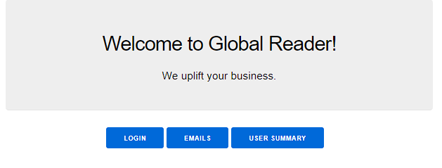
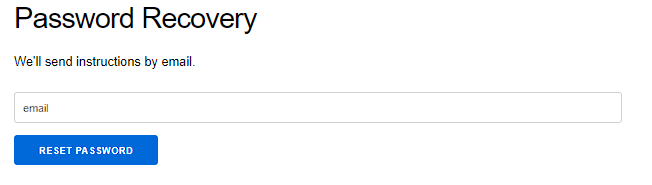
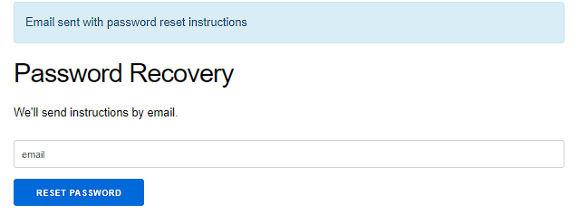
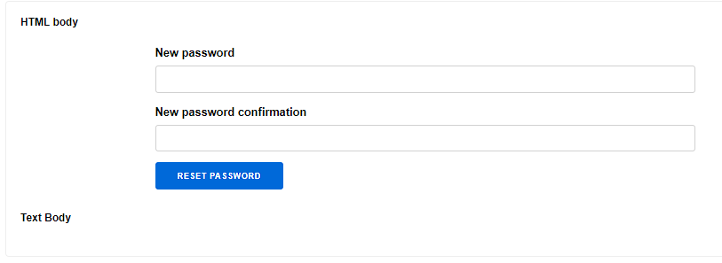
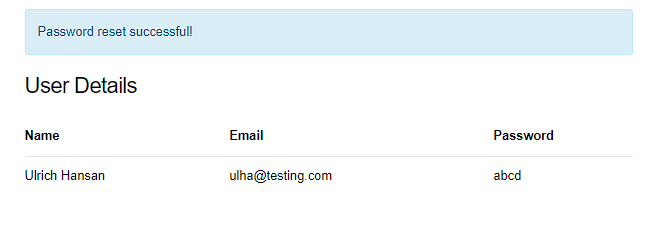

# GlobalReaderProject

To start your Phoenix server:

  * Install dependencies with `mix deps.get`
  * Create and migrate your database with `mix ecto.setup`
  * Install Node.js dependencies with `npm install` inside the `assets` directory
  * Start Phoenix endpoint with `mix phx.server`

Now you can visit [`localhost:4000`](http://localhost:4000) from your browser.

## Application Flow:

<b>Homepage:</b> 



<b> Login Page: </b> By clicking on Login button at home page routes to login page. User authetication and login function is not implemented. Also password is saved to database as plain text.


By clicking on forget password link routes to password recovery page. 



Some demo user is seeded to database for demonstration. ulha@testing.com is a valid email. By testing with this email, we can get following notification.



Now to simulate email sending, Bamboo package is used. To check new email, go back to home page and click on email.


Now by clicking on change password link from email inbox, will open password change form.



Entering and confirming updated password will routes to user details view where user with upadated password information can be seen. This is entirely for demonstration purpose. 




<b> User Device and Jobs Count: </b> To check users with jobs and device count information, go to homepage and click on user summary button.


<b> Generating Log: </b> Log to monitor endpoint is done with GensServer and module responsible for it is [log_monitor](lib/global_reader_project/urlmonitor.ex)

By running the application with `mix phx.server` automatically starts to write log in console twice a minute. 

Ecto Query to Generate Device & Job Count association with user is done as like below: 

```elixir

    query = from u in User,
            join: d in Device, on: d.user_id == u.id,
            join: j in Job, on: j.user_id == u.id,
            group_by: u.id,
            select: %{id: u.id, name: u.name, email: u.email, username: u.username,
            devices_count: count(fragment("DISTINCT ?", d.id)), jobs_count: count(fragment("DISTINCT ?", j.id))}

    data = query |> Repo.all() |> Enum.map(fn(user) -> struct(User, user) end)

```


## Acknowledgements

  * Official website: https://www.phoenixframework.org/
  * Guides: https://hexdocs.pm/phoenix/overview.html
  * Docs: https://hexdocs.pm/phoenix
  * Forum: https://elixirforum.com/c/phoenix-forum
  * ElixirCasts: https://elixircasts.io/
